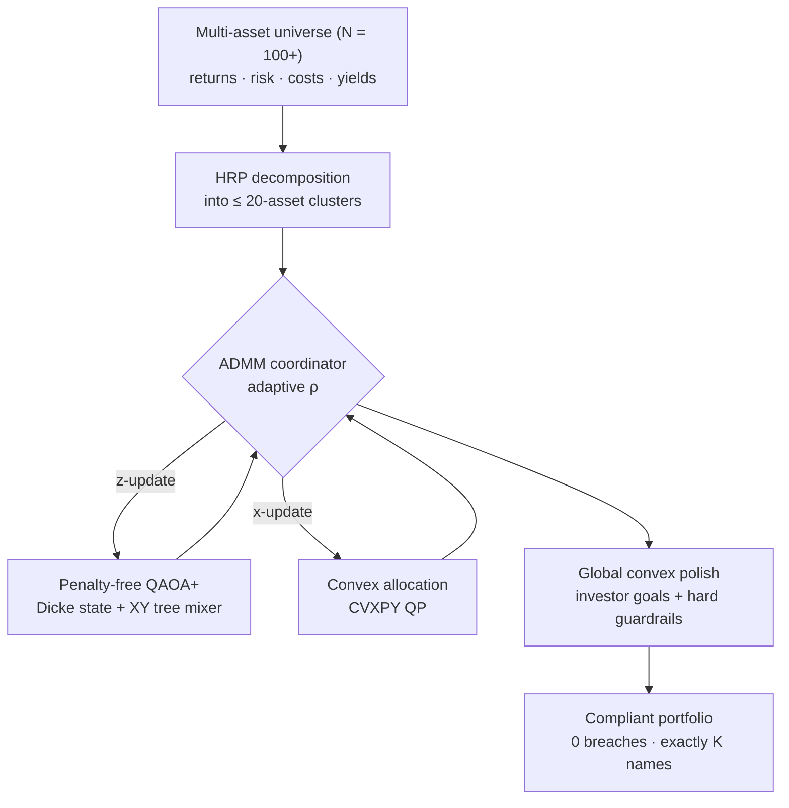

<div align="center">

# Feasibility by Physics, Not by Penalty

### A Penalty-Free Hybrid Quantum–Classical Pipeline for Multi-Asset Portfolio Construction

WISER Global Quantum+AI Program 2026 · Vanguard Challenge

[](LICENSE)
[](https://www.python.org/)
[](https://www.ibm.com/quantum/qiskit)
[](https://www.cvxpy.org/)
[](#reproducing-the-results)

</div>

---

## Overview

Multi-asset portfolio construction requires selecting a fixed number of
assets (**K of N**) and allocating capital across them while honoring hard
institutional guardrails — cardinality, position limits, asset-class caps,
income floors — and investor goals.

The conventional quantum formulation encodes the cardinality constraint as a
QUBO **soft penalty** `λ(Σzᵢ − K)²`. This forces an all-to-all interaction
graph, drowns the market signal beneath the penalty scale, and only
*encourages* feasibility — it can, and measurably does, return portfolios
that violate the mandate.

This project takes a different route: **feasibility is enforced by the
symmetry of the quantum circuit, not by a tunable penalty.** Asset selection
runs on a constraint-preserving QAOA whose every gate conserves the number of
selected assets, so an out-of-mandate portfolio is *physically impossible to
produce* — the measured probability of an infeasible state is ≈ 10⁻³³. Two
complete pipelines implement this idea, from a compact single-circuit
demonstrator up to a decomposed N = 100+ engine.

## Key results

All figures are measured from the committed code and reproducible from a
fixed seed. See [Reproducing the results](#reproducing-the-results).

| Metric | Result | Notes |
|---|---:|---|
| Hard-constraint breaches | **0** | Guaranteed by construction; confirmed by audit |
| Approximation ratio vs. certified optimum | **1.0000** | Against exhaustive enumeration at tested sizes |
| Feasible-subspace confinement (leakage) | **≈ 10⁻³³** | Random circuit parameters, any depth |
| Sharpe ratio (net of transaction costs) | **0.47** | N = 100, K = 20 |
| ADMM convergence | **~10⁻⁵** | Primal residuals, all 9 clusters |
| Largest circuit — routed 2-qubit gates | **1,735** | vs. competitor's required **24,530** on heavy-hex |
| Forecast robustness (μ ± 20%) | **0 breaches** | Guardrails hold under every perturbation |

## Architecture

The flagship OMEGA pipeline decomposes a large universe into
hardware-executable sub-problems and coordinates a classical convex solver
with a penalty-free quantum selector via ADMM.



## Projects

### 1. `vanguard_quantum` — Two-Phase Hybrid Pipeline
[`vanguard_quantum/`](vanguard_quantum/)

Quantum asset selection (Dicke-state initialization + XY ring-mixer QAOA,
Hamming weight conserved by construction) followed by classical convex
allocation (CVXPY). Ships exact MIQP and simulated-annealing baselines and a
three-tab Streamlit copilot. Verified to N = 40 via matrix-product-state
(tensor-network) simulation.

### 2. `vanguard_omega_pipeline` — ADMM-HRP-QAOA+ (OMEGA)
[`vanguard_omega_pipeline/`](vanguard_omega_pipeline/)

Scales to N = 100+. Hierarchical Risk Parity decomposes the universe into
≤ 20-asset clusters; an adaptive-ρ ADMM coordinator alternates a CVXPY
x-update with a penalty-free QAOA+ z-update on heavy-hex-embeddable
(degree ≤ 3) correlation spanning-tree mixers, with zero-noise extrapolation
and an exact classical fail-safe. Includes four tunable investor goals
(growth, income, drawdown control, cost sensitivity), a real-ETF market
snapshot mode, a forecast-robustness stress test, and a **measured — never
mocked** adversarial benchmark against a DBSCAN + soft-penalty-QUBO baseline
with real heavy-hex transpilation audits.

## Repository structure

```
.
├── vanguard_quantum/            # Two-phase hybrid pipeline + copilot
├── vanguard_omega_pipeline/     # OMEGA: ADMM-HRP-QAOA+ engine + dashboard
│   ├── src/                     # data, HRP, ADMM, x-step, z-step, metrics
│   ├── app/                     # Streamlit dashboard
│   └── data/                    # committed 41-ETF market snapshot
├── presentation/               # Competition deck (PPTX + PDF)
├── FORMULATION.md              # Consolidated mathematical formulation
├── README.md
└── LICENSE
```

## Installation

Requires Python 3.10+.

```bash
python -m venv .venv
.venv\Scripts\activate                       # Windows
# source .venv/bin/activate                  # macOS / Linux
pip install -r vanguard_omega_pipeline/requirements.txt
```

## Usage

```bash
# OMEGA dashboard — N = 100 pipeline, investor goals, benchmarks, audits
streamlit run vanguard_omega_pipeline/app/vanguard_dashboard.py

# Two-phase pipeline dashboard
streamlit run vanguard_quantum/app/copilot_ui.py
```

The OMEGA dashboard exposes three tabs — **Allocation** (final weights,
constraint audit, goal metrics, trade-offs vs. the HRP baseline), **ADMM
Convergence** (recorded residual and ρ trajectories), and **Hardware Audit**
(real heavy-hex transpilation and a zero-noise-extrapolation demo) — plus a
data-source toggle between the synthetic and real-ETF universes.

## Reproducing the results

Every headline figure is produced by code, from a fixed seed, with no mocked
values. The mathematical claims are backed by numerical verification:

- **Ising encoding** — `⟨z|H_C|z⟩ + c = q·zᵀΣz − μᵀz` verified against
  brute force over all basis states.
- **Feasibility by symmetry** — probability outside the weight-K shell
  ≈ 10⁻³³ at random circuit parameters.
- **Solution quality** — approximation ratio 1.0000 against a certified
  exhaustive optimum at tested sizes.
- **Guardrails** — zero hard-constraint breaches on every produced book,
  including under ±20% expected-return perturbations.

The companion engine repository runs an equivalent invariant suite under
continuous integration.

## Mathematical formulation

The full problem statement — binary decision variables, linear constraints,
quadratic objective, and the penalty-free quantum-compatible derivation — is
documented in **[FORMULATION.md](FORMULATION.md)**.

## Deliverables

- **Presentation deck** — [`presentation/WISER_Vanguard_OMEGA.pptx`](presentation/WISER_Vanguard_OMEGA.pptx) (PDF alongside)
- **Formulation** — [`FORMULATION.md`](FORMULATION.md)
- **Companion engine** — [omega-portfolio-engine](https://github.com/hastikacheddy/omega-portfolio-engine): the production-hardened engine form (compliance gating, audit manifests, walk-forward backtest, CI, model card)

## Author

**hastikacheddy** — [github.com/hastikacheddy](https://github.com/hastikacheddy) · hastikacheddy06@gmail.com (solo submission)

## Credits & attribution

**Data.** The committed ETF price snapshot
([`vanguard_omega_pipeline/data/etf_prices.csv`](vanguard_omega_pipeline/data/etf_prices.csv))
is daily adjusted closes retrieved once from **Yahoo Finance** via the
[`yfinance`](https://github.com/ranaroussi/yfinance) library, for research
demonstration only. All other data is synthetic and generated by the code.

**Open-source tools.**
[Qiskit](https://www.ibm.com/quantum/qiskit) / Qiskit Aer / Qiskit Algorithms ·
[CVXPY](https://www.cvxpy.org/) (Clarabel / OSQP / ECOS / SCS) ·
[NumPy](https://numpy.org/) · [SciPy](https://scipy.org/) ·
[pandas](https://pandas.pydata.org/) ·
[scikit-learn](https://scikit-learn.org/) (DBSCAN — used **only** in the
adversarial competitor benchmark, never in the OMEGA pipeline) ·
[Streamlit](https://streamlit.io/) · [Plotly](https://plotly.com/) ·
[PptxGenJS](https://gitbrent.github.io/PptxGenJS/).

**Methods.**
Hierarchical Risk Parity — López de Prado (2016) ·
deterministic Dicke-state preparation — Bärtschi & Eidenbenz (arXiv:1904.07358) ·
ADMM — Boyd et al. (2011) ·
CVaR portfolio optimization — Rockafellar & Uryasev (2000) ·
CVaR-aggregated QAOA — Barkoutsos et al. (*Quantum* 4, 256, 2020).

## License

Released under the [MIT License](LICENSE).
